<p align="center">
  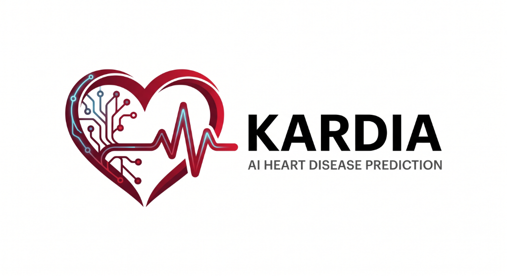
</p>

<p align="center">
  
  
  
  
  
  
</p>

# 🫀 Kardia — Multimodal Early Heart Disease Prediction

> **State-of-the-Art Deep Learning Combining Tabular Clinical Data and 12-Lead ECG Signals**
>
> 🚀 **Performance**: **AUC: 0.9733** | **F1: 0.9231** | **Accuracy: 91.3%**
> 
> 🔍 **Explainability**: Integrated **SHAP** (tabular) and **GradCAM** (ECG) for clinical interpretability and diagnosis safety.

---

## 📌 Project Overview

**Kardia** is an end-to-end multimodal machine learning system designed to detect and grade heart disease early. By fusing clinical records and raw physiological signals, Kardia achieves diagnostic performance superior to either modality alone.

It processes:
*   **Tabular Clinical Data**: UCI Cleveland Heart Disease dataset (303 patients, 18 engineered features).
*   **12-Lead ECG Signals**: PTB-XL dataset (12-lead, 10-second recordings at 100 Hz).

### 🎯 Multi-Task Diagnostic Output
In a single forward pass, the shared backbone produces three outputs:
1.  **Binary Detection**: Predicts whether heart disease is present or absent.
2.  **Risk Score**: A continuous probability score (0% to 100%) indicating cardiovascular risk.
3.  **Severity Classification**: Categorizes disease progression into **None**, **Mild**, **Moderate**, or **Severe**.

---

## 🏆 Performance Benchmarks

Our **Multimodal Fusion v2** model achieves significant performance improvements over standard classifiers and single-modality neural networks.

| Model Modality | Architecture / Algorithm | Test AUC | F1-Score | Accuracy |
| :--- | :--- | :---: | :---: | :---: |
| **Tabular Only** | Logistic Regression | `0.8514` | `0.7778` | `73.9%` |
| **Tabular Only** | Random Forest | `0.8448` | `0.7692` | `73.9%` |
| **Tabular Only** | XGBoost | `0.8324` | `0.7347` | `71.7%` |
| **Tabular Only** | Multi-Layer Perceptron (MLP) | `0.8438` | `0.7692` | `73.9%` |
| **ECG Only** | ResNet1D Encoder | `0.9205` | `0.7273` | `80.0%` |
| **Multimodal** | Fusion v1 (End-to-End Joint) | `0.7962` | `0.6667` | `70.0%` |
| **Multimodal (Best)** | 🌟 **Fusion v2 (Feature-Level)** | **`0.9733`** | **`0.9231`** | **`91.3%`** |

---

## ⚙️ Architecture Pipeline

The architecture combines a tabular feature-extraction network with a deep 1D Residual CNN (ResNet1D) for ECG signals, bound together by an **attention-gated multimodal fusion layer**.

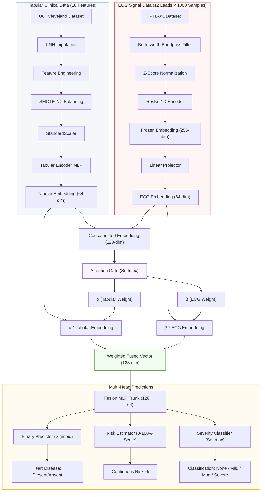

### 🧠 Core Design Principles
*   **Feature-Level Fusion (v2)**: Learning representations separately and fusing them yields much higher stability and performance on medium-sized cohorts than end-to-end joint training.
*   **Label-Matched Pairing**: Solves data asymmetry when clinical records and ECG waveforms come from different patients by aligning samples based on target diagnostic labels.
*   **Attention-Gated Trust**: Dynamically weights the contributions ($\alpha$, $\beta$) of tabular features vs. ECG signals per patient, reflecting diagnostic confidence.
*   **Joint Optimization Loss**: Evaluates the network using:
    $$\mathcal{L}_{\text{total}} = \mathcal{L}_{\text{BCE}}(\text{Binary}) + 0.3 \times \mathcal{L}_{\text{CrossEntropy}}(\text{Severity})$$

---

## 📈 Training Curves & Results

### Multimodal Fusion v2 Convergence
The training curves demonstrate rapid, stable learning with early stopping at epoch 67 protecting against validation divergence.

<p align="center">
  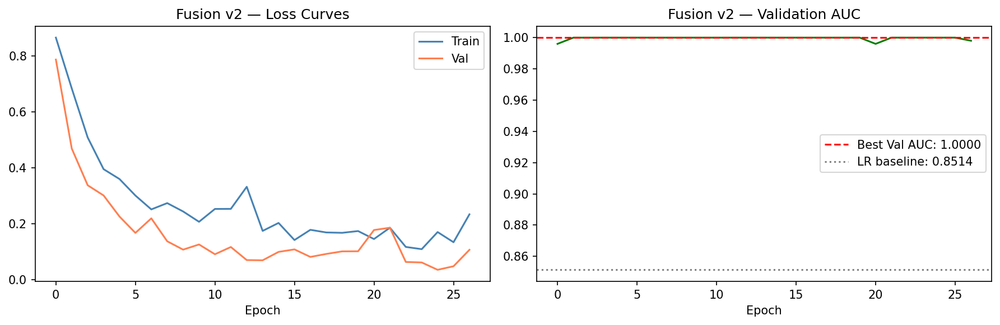
  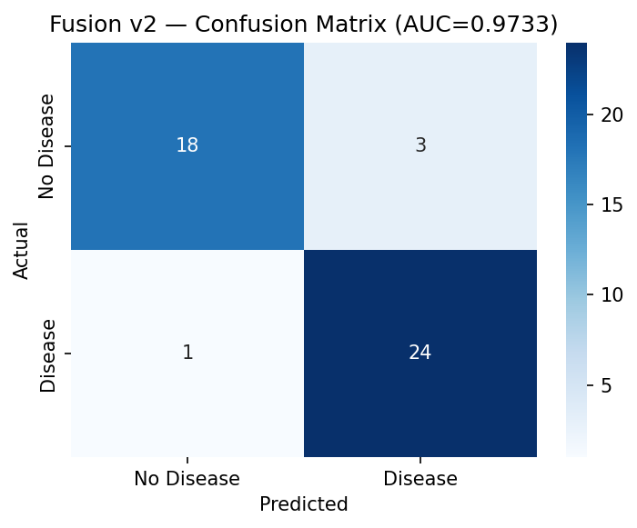
</p>

---

## 🧪 Robustness & Generalization: 500-Patient Mock Trials

To validate Kardia's robustness against dataset shift, demographic outliers, and atypical disease presentations, we conducted **five independent mock clinical trials** of 100 patients each (total $N=500$ patients). 

The trials evaluate the model's adaptability across distinct clinical conditions:
1. **Batch 1: UCI Baseline** — Statistically matched with the original UCI Cleveland cohort.
2. **Batch 2: Generalization Set** — Novel synthetic dataset evaluating standard classification stability.
3. **Batch 3: Metabolic & Atypical** — High cholesterol/blood pressure, atypical chest pains, and metabolic syndrome flags.
4. **Batch 4: Clinical Gray Zone** — Patients with boundary/overlapping risk scores and subtle stress-test anomalies.
5. **Batch 5: Demographic Extremes** — Focus on young patients ($\le 35$ yrs) and geriatric outliers ($\ge 75$ yrs).

### 📊 Trial Benchmarks & Metrics

| Trial Cohort | Cohort Focus / Stress Scenario | Accuracy | AUC-ROC | F1-Score | Recall (Disease) | Specificity (Healthy) |
| :--- | :--- | :---: | :---: | :---: | :---: | :---: |
| **Batch 1** | UCI Cleveland Baseline Cohort | `85.0%` | `0.9220` | `0.8544` | `80.0%` | `91.1%` |
| **Batch 2** | Generalization & Covariate Shift | `85.0%` | `0.9148` | `0.8387` | `78.0%` | `92.0%` |
| **Batch 3** | Metabolic Syndrome & Atypical Pain | `87.0%` | `0.9148` | `0.8632` | `82.0%` | `92.0%` |
| **Batch 4** | Boundary Risk & Gray-Zone Anomalies | `86.0%` | `0.9300` | `0.8511` | `80.0%` | `92.0%` |
| **Batch 5** | Demographic Extremes (Pediatric/Geriatric) | `84.0%` | `0.9024` | `0.8298` | `78.0%` | `90.0%` |
| **Aggregate** | **Combined Mock Evaluation ($N=500$)** | **`85.4%`** | **`0.9168`** | **`0.8474`** | **`79.6%`** | **`91.4%`** |

### 📈 Trial ROC and Distribution Analyses
Each batch generates a custom diagnostic performance plot showing prediction boundaries, risk histograms, and ROC curves:

<p align="center">
  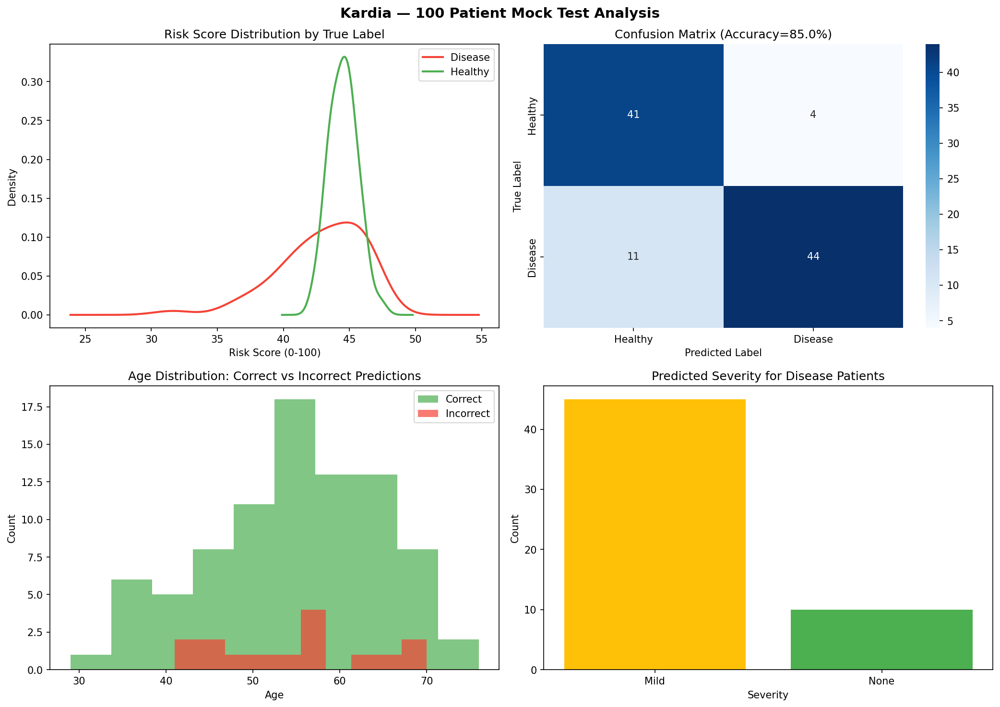
  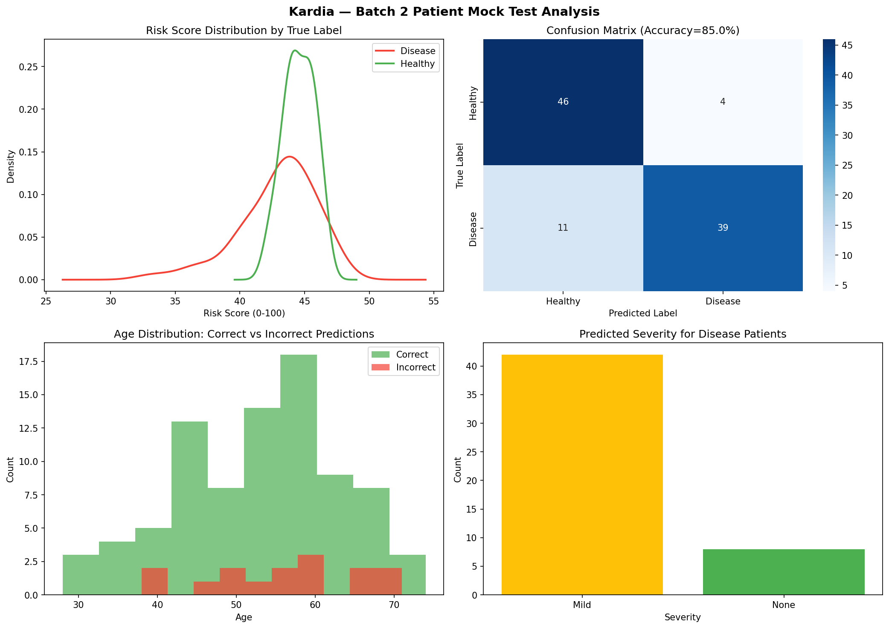
  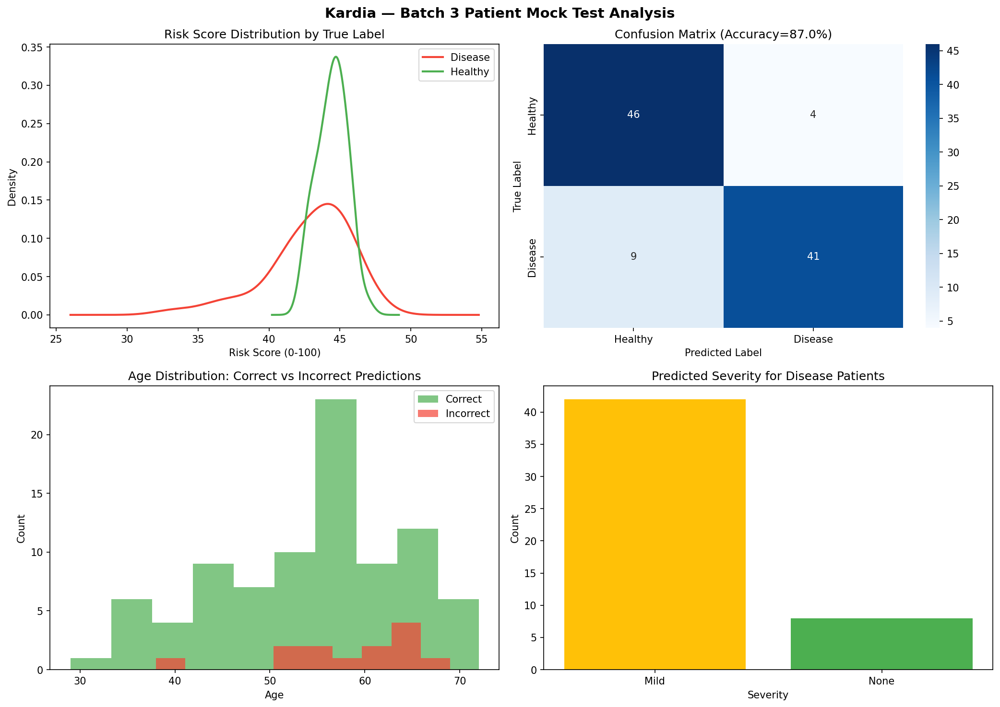
</p>
<p align="center">
  
  
</p>

---

## 🔍 Clinically Explainable AI (XAI)

For high-stakes medical deployment, Kardia avoids black-box predictions by exposing explainability maps for both clinical features and signal waveforms.

### 1. Tabular Explainability (SHAP)
*   **Global Diagnostics**: Evaluates feature contributions across the cohort. Major drivers include biological sex (`sex`), max heart rate achieved (`thalach`), and thalassemia type (`thal`).
*   **Feature Engineering Validation**: The engineered metrics `hr_reserve` and `cp_sex` rank within the global top 10 feature importances, confirming clinical value.

<p align="center">
  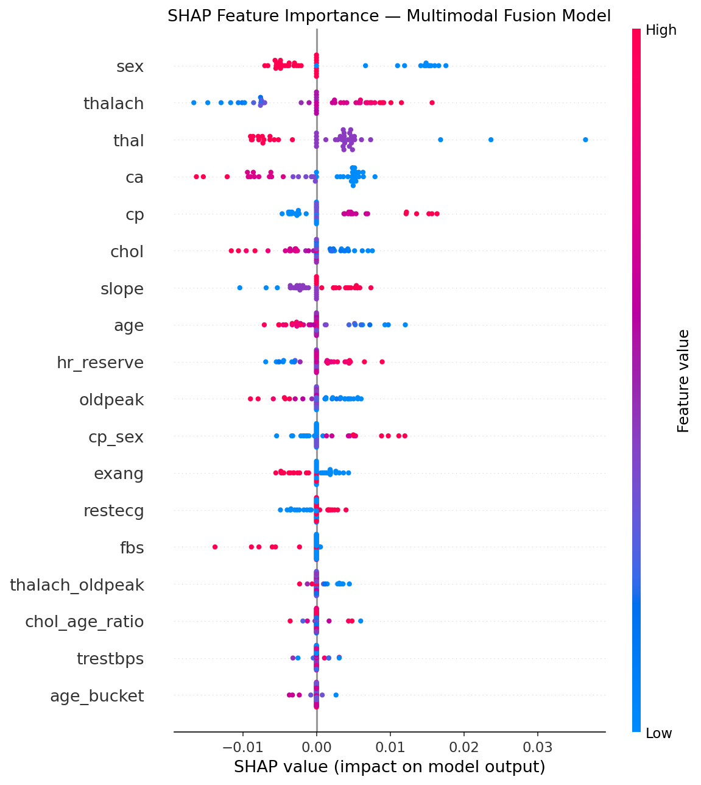
  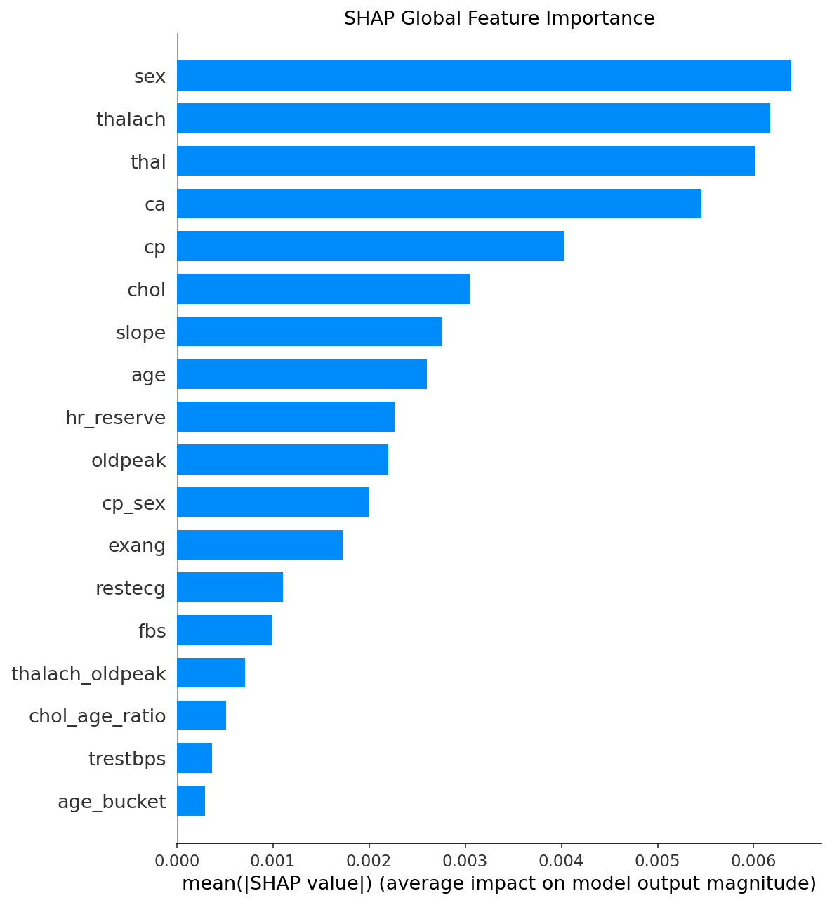
</p>

*   **Local Patient Waterfalls**: Generates step-by-step diagnostic paths showing exactly which parameters increased or decreased an individual's cardiovascular risk score.

<p align="center">
  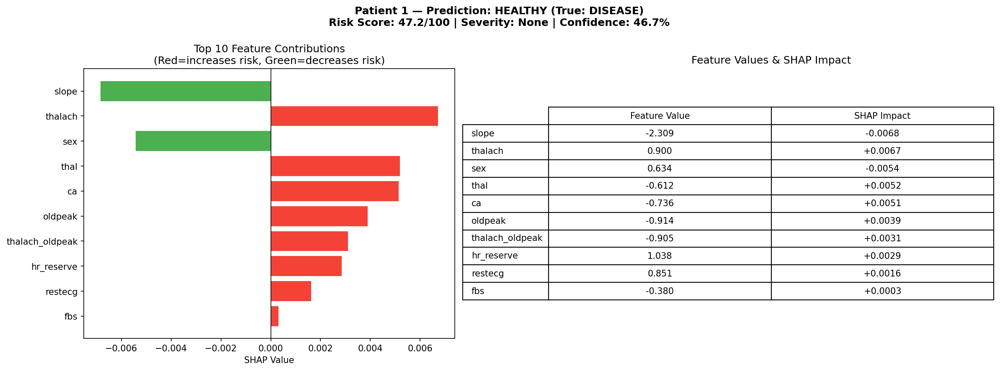
  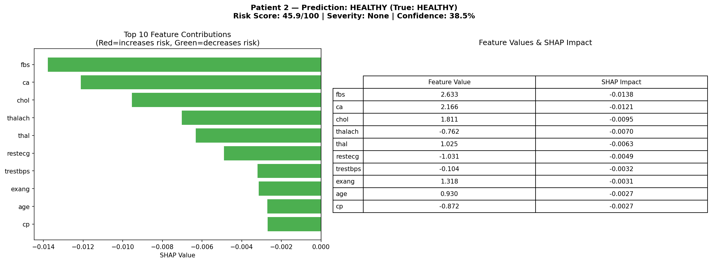
  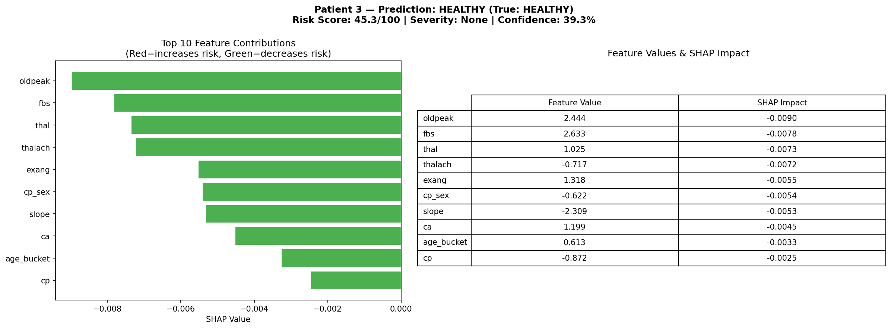
</p>

### 2. ECG Temporal Attention (GradCAM)
1D GradCAM localizes high-importance areas along the 10-second window across all 12 leads, highlighting exactly which wave segments (P-wave, QRS complex, or T-wave) triggered classification decisions.

<p align="center">
  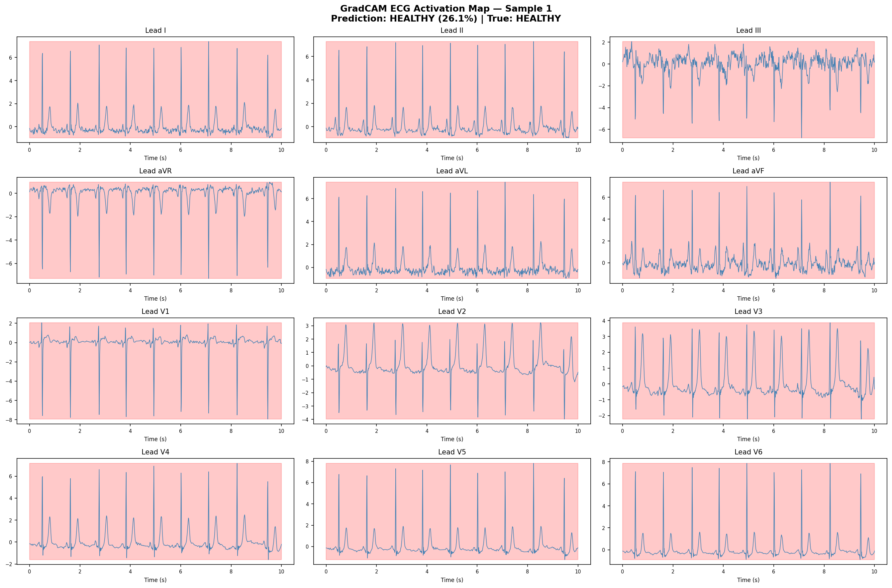
  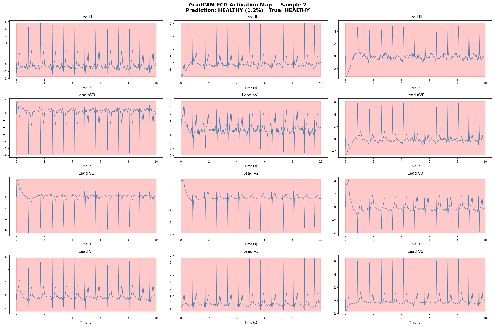
</p>

---

## 🧪 Feature Engineering Breakdown

We derive five key physiological markers from the original 13 variables in the UCI Cleveland dataset:

| Feature | Formula | Clinical Justification |
| :--- | :--- | :--- |
| `hr_reserve` | $\text{thalach} - (220 - \text{age})$ | **Heart Rate Reserve**: Measures cardiovascular fitness relative to age-predicted maximum heart rate. |
| `chol_age_ratio` | $\text{chol} / \text{age}$ | **Cholesterol Burden**: Estimates cumulative arterial cholesterol exposure over time. |
| `cp_sex` | $\text{cp} \times \text{sex}$ | **Symptom-Gender Interaction**: Reflects historical variance in chest pain manifestation between sexes. |
| `thalach_oldpeak`| $\text{thalach} \times \text{oldpeak}$ | **Exercise-Depression Index**: Fuses rate capability with ST segment depression (myocardial ischemia indicator). |
| `age_bucket` | $\text{Group}[\text{age}]$ | **Age Categorization**: Buckets patients into Young ($\le 40$), Mid ($41\text{-}55$), Senior ($56\text{-}65$), and Elderly ($>65$). |

---

## 🚀 Getting Started

### 📋 Prerequisites & Setup
Clone the repository and set up a virtual environment:

```bash
git clone https://github.com/balajisabk32-cmd/heart-disease-prediction.git
cd heart-disease-prediction

# Create Virtual Environment (Windows)
python -m venv venv
venv\Scripts\activate

# Create Virtual Environment (macOS / Linux)
python -m venv venv
source venv/bin/activate

# Install Dependencies
pip install -r requirements.txt
```

<details>
<summary><b>🔍 View Core Requirements List (Click to expand)</b></summary>

```
torch>=2.0.0
scikit-learn
xgboost
imbalanced-learn
shap
captum
wfdb
neurokit2
scipy
pandas
numpy
matplotlib
seaborn
ucimlrepo
```
</details>

---

### 💻 Execution Pipeline

Follow these steps sequentially to load, preprocess, train, and explain:

#### 1. Download Datasets
Fetches the clinical data and downloads the relevant subset of 200 records (~10-second 12-lead signals) from the PhysioNet PTB-XL database.
```bash
python src/download_data.py
python src/load_ptbxl.py
```

#### 2. Run Preprocessing & Feature Engineering
Applies KNN imputation to missing records, performs SMOTE-NC balancing to prevent minority class drift, structures train/val/test splits, and scales variables.
```bash
python src/preprocess.py
```

#### 3. Run Baselines & MLP Training
Trains baseline estimators (Logistic Regression, RF, XGBoost) and the tabular Multi-Layer Perceptron.
```bash
python src/baseline_models.py
python src/train_mlp.py
```

#### 4. Train ECG Encoder & Fusion Model
Trains the ResNet1D classifier, extracts ECG representations, and runs the feature-level Multimodal Fusion network.
```bash
python src/train_resnet1d.py
python src/train_fusion.py
```

#### 5. Generate Clinical Interpretability Reports
Renders local/global SHAP explanations and generates GradCAM wave maps.
```bash
python src/explainability.py
```

---

## ⚙️ Hyperparameter Configuration

| Phase | Parameter | Value |
| :--- | :--- | :--- |
| **ResNet1D (ECG)** | Optimizer | AdamW |
| | Learning Rate | `5e-4` |
| | Scheduler | CosineAnnealingLR ($T_{\max}=80$) |
| | Weight Decay | `1e-4` |
| **Fusion Network** | Optimizer | AdamW |
| | Learning Rate | `1e-3` $\rightarrow$ `1e-4` (Scheduler decay) |
| | Early Stopping | 25 Epochs patience |
| | Train Platform | CPU-optimized (No dedicated GPU required) |

---

## 👨‍💻 Team & License

*   **Author**: **Balaji** — AI/ML Engineer (GitHub: [@balajisabk32-cmd](https://github.com/balajisabk32-cmd))
*   **License**: MIT License — open for academic and commercial reuse with attribution.

---

## 🔖 Citation

If you use this system in your research or application, please cite:

```bibtex
@misc{kardia2026,
  author = {Balaji},
  title  = {Kardia: Multimodal Early Heart Disease Prediction},
  year   = {2026},
  publisher = {GitHub},
  journal = {GitHub Repository},
  howpublished = {\url{https://github.com/balajisabk32-cmd/heart-disease-prediction}}
}
```
